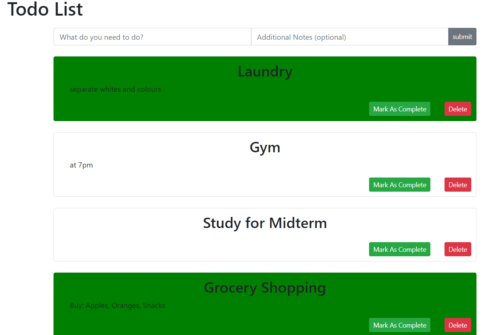

# React and Redux learning

## A Simple TODO list created with react & redux

This is a simple TODO list project that I created to learn react and redux basics. You can enter an task you need to do as well as notes about the task. Tasks can be marked as complete and will turn green and can also be deleted.

This project was bootstrapped with [Create React App](https://github.com/facebook/create-react-app).

## Available Scripts

In the project directory, you can run:

### `npm start`

Runs the app in the development mode. 
Open [http://localhost:3000](http://localhost:3000) to view it in the browser.

